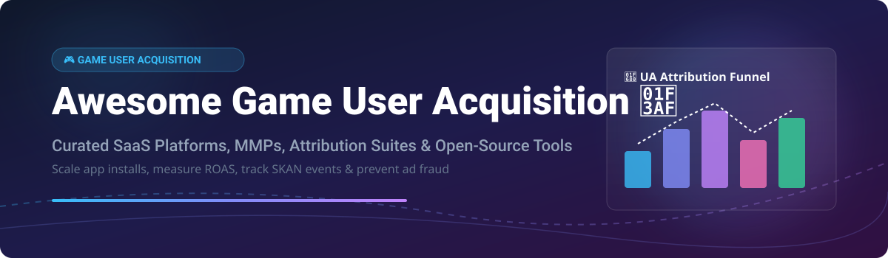

# 🎯 Awesome Game User Acquisition & Mobile Measurement (MMP) Ecosystem

  

  
  
  
  

---

## 💡 Overview & SEO Keywords
Welcome to the definitive, curated list of **Game User Acquisition (UA) platforms**, **Mobile Measurement Partners (MMP)**, **ad attribution engines**, **SKAdNetwork (SKAN) tooling**, and **open-source marketing analytics repositories**. Designed for mobile game developers, indie studios, user acquisition managers, and growth marketers scaling mobile app installs and ROAS.

---

## 📊 Market Overview & Industry Structure
> **Market Size & Structure:** The global Mobile Attribution & User Acquisition market is estimated at **$4.2 Billion (2026)** and growing at ~14.5% CAGR. The MMP sector is **moderately concentrated** with strong network effects (top leaders like Liftoff, AppsFlyer, AppLovin/Adjust hold a majority share), while the self-hosted analytics & tooling layer remains **fragmented** with rising open-source privacy solutions.

---

## 🚀 Commercial SaaS Platforms & MMPs

The following commercial SaaS solutions and Mobile Measurement Partners are sorted by **Company Size (Revenue / Valuation)** in descending order.

| Platform / MMP 🏢 | Estimated Size (Revenue / Valuation) 💰 | Starting Pricing Tier 🏷️ | Free Tier / Free Trial Limits 🎁 | Key Features & Focus ⚡ |
| :--- | :--- | :--- | :--- | :--- |
| **[Liftoff](https://liftoff.io/)** 🚀 | **~$3.83B Valuation** ($799M ARR) | CPI / CPA performance media budget | No free plan; custom media testing budget required | Mobile DSP, programmatic UA, & app retargeting platform. |
| **[AppsFlyer](https://www.appsflyer.com/)** 📈 | **$2.7B Valuation** ($500M ARR) | Growth Plan at ~$0.07 / conversion | **Zero Plan:** 12,000 free conversions for first 12 months | Market leader in mobile measurement, SKAN, & fraud defense. |
| **[Adjust](https://www.adjust.com/)** (AppLovin) 🎯 | **~$1.2B Acquisition** (AppLovin app suite) | Custom Enterprise contract (Quote-based) | Free demo available; trial by sales request | MMP focused on performance marketing, automation, & CTV. |
| **[Branch](https://www.branch.io/)** 🔗 | **$4.0B Valuation** (~$125M ARR) | Paid self-serve starting at ~$0.05 / link | **WarpLink:** Free up to 10,000 clicks/mo + 30-day trial | Deep linking, cross-platform attribution, & web-to-app. |
| **[Kochava](https://www.kochava.com/)** 🛡️ | **~$50M ARR** (Private) | Foundation plan starting at **$500/mo** | **Free App Analytics:** Free for organic event tracking | Configurable MMP, fraud protection, & data ownership. |
| **[Singular](https://www.singular.net/)** 📊 | **~$52.6M ARR** ($50M raised) | Growth Plan starting at ~$795/mo | **Free Tier:** Up to 15,000 paid conversions included | Cost aggregation, ROAS unification, & marketing analytics. |
| **[Remerge](https://www.remerge.io/)** 🔄 | **~$50M ARR** (Private) | Media spend take-rate model | No free plan; requires active campaign budget | Specialized mobile DSP for retargeting & re-engagement. |
| **[AppSamurai](https://appsamurai.com/)** ⚔️ | **~$12M ARR** ($4.6M raised) | Pay-per-campaign (CPI/CPA) | Freemium analytics dashboard; pay only for campaigns | Self-service mobile UA & campaign growth platform. |
| **[Tenjin](https://www.tenjin.io/)** 🎮 | **~$10M ARR** (Private) | All-Inclusive Paid Plan from **$200/mo** | **Free Plan:** 2,000 free attributions/mo + unlimited organic | Cost-effective MMP & data warehouse for indie game studios. |

---

## 🔓 Open-Source GitHub Projects

Curated open-source projects for self-hosted event tracking, privacy-first mobile analytics, deep linking, and custom attribution pipelines. Sorted by **GitHub Stars (Descending)**.

| Repository 📦 | GitHub Stars ⭐ | Description & UA Use Case 🛠️ |
| :--- | :--- | :--- |
| **[PostHog](https://github.com/PostHog/posthog)** 🦔 |  | Open-source product analytics, feature flags, and event tracking platform. |
| **[Plausible Analytics](https://github.com/plausible/analytics)** 🌐 |  | Lightweight, privacy-first open analytics for tracking web conversion funnels. |
| **[Countly](https://github.com/Countly/countly-server)** 📊 |  | Product analytics and mobile event tracking backend with privacy focus. |
| **[ClickHouse](https://github.com/ClickHouse/ClickHouse)** ⚡ |  | Ultra-fast column-oriented OLAP database used to build custom UA data warehouses. |
| **[Aptabase](https://github.com/aptabase/aptabase)** 📱 |  | Open-source, privacy-first analytics SDKs for mobile & desktop apps. |
| **[Singular SKAdNetwork App](https://github.com/singular-labs/Singular-SKAdNetwork-App)** 🍏 |  | Reference implementation for iOS SKAdNetwork postbacks and ad signing. |
| **[LinkForty Core](https://github.com/LinkForty/core)** 🔗 |  | Self-hosted deep linking engine and deferred dynamic link routing tool. |
| **[SKAdNetwork IDs List](https://github.com/skadnetwork/ad-network-ids)** 📜 |  | Community-maintained collection of registered Apple SKAdNetwork IDs for Info.plist. |
| **[OpenAttribution](https://github.com/OpenAttribution/open-attribution)** 🔓 |  | Open-source Mobile Measurement Platform (MMP) initiative for custom tracking. |

---

## 🤝 How to Contribute
1. Fork this repository 🍴
2. Add or update entries in `README.md` following the table format 📝
3. Ensure descriptions are objective and link to official documentation 🔗
4. Submit a Pull Request (PR) with a brief summary 🚀

---

## 📈 Star History

---

## 💖 Support & Community
If you find this repository helpful for your mobile game growth or user acquisition research, please consider supporting the project:

- 🌟 **Star this repository** to help others discover it!
- 🍴 **Fork it** to add your own tools or custom notes.
- 📢 **Share it** with fellow game developers and growth marketers.
- ☕ **Buy me a coffee / Sponsor**: Support ongoing maintenance on the [GitHub Sponsor Dashboard](https://github.com/sponsors/ishandutta2007).

---

## ⚠️ Disclaimer
This list is community-curated for informational purposes. Mobile attribution and event measurement process end-user data subject to privacy regulations (GDPR, CCPA, Apple ATT). Always verify compliance and SDK terms directly with platform providers.
